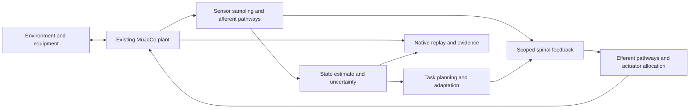

# Proposed functional nervous system architecture

Prepared 2 October 2026. This is a proposed engineering specification. The contracts and controllers below are not implemented or validated. It describes a functional model of sensory processing, motor planning, spinal control and peripheral transmission; it does not claim to reproduce a biological cortex.

Movement requirements, defects, references, ownership and acceptance remain in the [single master catalogue](../MASTER-MOVEMENT-JOINT-CATALOGUE.html), governed by the [catalogue process](../movement-catalogue-process.md). This document supplies architecture decisions, not a second movement ledger. Scientific sources belong with [research and sources](01-research-and-sources.md); experiment methods and delivery dependencies are developed in [validation](04-validation-and-experiments.md) and [delivery roadmap](05-delivery-roadmap.md).

## Inspected foundation and integration boundary

The active engine checkout reported HEAD `274ad55a3a84df593c12c24852ec80bc744d3d13`; simMOVE reported `82f04b8c6f94b08e88f742cecc7de9ca1b207a2f`. Both contain uncommitted changes. A HEAD identifies their committed base, not all inspected bytes. The [current-state scope](00-current-state-and-scope.md) and [selected input snapshot](current-state-snapshot.json) retain inspection identities; these are not catalogue acceptance identities. Existing floor-contact, recording, joint-frame and native retargeting corrections must be preserved and reconciled before integration.

| Inspected implementation | Present behavior | Proposed use |
| --- | --- | --- |
| `simmove/experiments/lower-body/model.mjs`, actuator XML and stepping | Bounded joint motors; gravity; contact; declared passive resistance | Preserve the physical plant and caps while introducing explicit observation/control interfaces |
| `authored-task-controller.mjs` and `assessment-support-controller.mjs` | Task and support feedback read native state directly | Retain as privileged-state engineering baselines; migrate selected feedback to observations before sensory claims |
| `pose-engine/src/services/romConstraints.ts` | Patient ROM restriction, painful-arc metadata and end-feel | Import specified case constraints with their provenance; distinguish them from physiology |
| `movementFaults.ts` | Prescribed phase-aware compensation transforms | Reference demonstrations and comparison controls; distinguish prescribed from emergent compensation |
| simLAB `packages/ddx/src/movement/builderSteps.ts` | ROM, reflex and sensory playback follows authored findings | Keep specified exam results separate from simulation-generated findings |
| `authored-route-packet.mjs` and simMOVE physics runner | Input identities, invalidation and local native replay | Extend identity and recording to neural state, sensor history and policy versions |

Native calculation remains restricted by `EditingWorkspace.svelte`'s `import.meta.env.DEV`; simLAB's sampler delivers shared authored motion. This proposal does not establish a hosted simulation pathway or student replay parity. See the inspected [pipeline audit](../movement-pipeline-audit-2026-10-02.md).

## Three distinct views of state

The **physical plant** owns native joint states, contacts, muscle/tendon states when introduced, and environmental dynamics. An **observation adapter** samples allowed channels and produces time-stamped afferents. The **functional controller** sees only delivered observations, task intent, a known model and its own history. A **presentation/evidence adapter** may display physical truth and controller estimates side by side with clear labels.



This is our proposed modular design. Module names are functional abstractions, not anatomical equivalence claims. Vision and vestibular channels may initially use explicitly declared engineering observations; that does not make them validated retinal or labyrinth models. Muscle-length/rate and force proxies become physiologically meaningful only after the underlying musculotendon model and sensor formulation are justified.

## Deterministic observation and execution rules

Every sensor packet records sample time, delivery time, units, frame, validity and uncertainty. Delay is a queue operation; noise is a versioned transformation with seeded randomness; loss is explicit missing data. Each sensor has its own random stream so adding an unrelated sensor cannot change existing noise. Profiles specify assumptions and evidence instead of embedding universal physiological values.

Use a fixed simulation clock and a declared event schedule for physics, sensors, controller updates, planning and telemetry. Define event ordering at coincident timestamps, initial buffer contents, interpolation rules and stale-data behavior. Never deliver a future sample. Checkpoint physics, neural state, queues, random-stream state and task phase together. Browser frame timing must not determine control timing.

Task intent must resolve to versioned goals in named frames, allowed supports/equipment, loads, phase transitions, admissible strategies and measured completion criteria. Reference trajectories may supply declared feedforward intent; achieved future state is unavailable. Execute the plant/controller in the existing worker boundary, then send synchronized display frames to hosts. Native replay must drive the bound rig from achieved native state; rerunning the authored sampler or layering a second deformation would break that correspondence. Audit this adapter before student delivery.

The proposed controller interface receives no mutable `mjData`, hidden pose truth, native contact array or achieved future state. Known task schedules and static model assumptions may be declared inputs; they do not permit live physical truth to be relabeled as task context. Existing controllers require refactoring, not merely a noise wrapper: their contact Jacobians and gravity/support calculations currently use native state. Compute these terms from estimated state and explicitly permitted prior model knowledge. A privileged controller remains a separately labeled diagnostic comparison. A truth-based safety monitor may terminate an invalid trial and record why; it cannot quietly correct the body or inject extra torque.

Controller knowledge needs its own allowlist and immutable manifest. IDs must not provide a lookup route to hidden lesion, load or plant parameter changes. In acute comparisons, preserve the same policy and prior model knowledge across conditions; the altered patient state belongs to the plant and pathway adapter. Disclosed injury knowledge or learned capacity estimates constitute separate assistance/adaptation conditions. Record the controller-visible packet as well as the hidden plant configuration so this distinction can be audited.

The current workers expose enabled/effort controls and the models calculate their existing feedback internally; the proposed command packet is not yet a working runtime API. Implement a mutually exclusive per-step controller and actuation strategy for each selected degree of freedom. The experimental strategy replaces existing PD/support actuation on those coordinates instead of adding torque atop it or translating a torque command into an effort multiplier. Record prescribed supports and unaffected stabilizers. Report experimental actuation, any reserve motors, support reactions and external forces separately, with authoritative limits and tests that detect double actuation.

```ts
// Proposed API sketch; shapes and schema version are to be finalized.
interface ObservationPacket {
  sensorId: string;
  sampleTimeS: number;
  deliveryTimeS: number;
  frameId: string;
  unit: string;
  values: readonly number[] | null;
  uncertaintyModelId: string;
  validity: 'valid' | 'missing' | 'stale';
}
type ActuationCommand =
  | { kind: 'joint-torque'; torqueNm: Readonly<Record<string, number>> }
  | { kind: 'muscle-excitation'; excitation: Readonly<Record<string, number>> };
interface ControllerInput {
  simulationTimeS: number;
  observations: readonly ObservationPacket[];
  taskIntentId: string;
  controllerKnowledgeManifestId: string;
  modelKnowledgeId: string;
}
// controller.step(input, priorControllerState) returns command + next state.
// Only the plant adapter writes native actuation; caps remain authoritative.
```

## Functional control and patient state

| Module | Proposed responsibility | Evidence needed before a physiological claim |
| --- | --- | --- |
| State estimator | Estimate pose, velocity and support; track uncertainty and missing observations | Reconstruction and perturbation tests against withheld truth |
| Task planner | Choose goals, phases and admissible strategies under capacity/support constraints | Successful supported tasks plus failure and adaptation comparisons |
| Spinal feedback | Task-scoped feedback from declared afferent channels, with modulation | Input/output, latency, gain and lesion experiments justified by sources |
| Efferent pathways | Map descending/reflex drive through lesion-dependent transmission | Traceable transmission definitions and independent response checks |
| Actuator allocator | Map intent to existing capped torque, then calibrated muscle excitations | Feasibility, saturation, work and recruitment checks |

Patient anatomy, lesion description, physiological parameter set, learned-policy identity and specified examination are separate versioned objects. A lesion maps many-to-many through root/fiber population, plexus or peripheral branch, muscle and sensory territory. Preserve side, anatomical level, affected modality, uncertainty and provenance. Do not convert a dermatome label into a unique motor deficit, or assign root contribution weights without evidence.

Central control impairment, peripheral transmission impairment and orthopedic changes target different modules. Proposed examples include altered descending selectivity, reduced efferent availability, degraded sensory delivery, altered tendon mechanics and restricted joint mobility. They are parameterized hypotheses until calibrated. Velocity-dependent tone, fatigue and pain-related guarding require their own state/equations and validation; a global strength multiplier cannot establish them.

The proposed first experiment is supported elbow flexion/extension, comparing intact feedback, an isolated impairment and a controlled perturbation. Select an exact existing fixture only after auditing its joint/support validity and reference data; this document does not imply that an isolated limb task is already qualified. Compensation counts as emergent only when the controller selects it from the same goal and altered constraints. A hand-authored steppage overlay remains an authored example.

## Actuation progression and scientific boundaries

Keep joint-torque control for interface development. Add an antagonist-muscle subsystem only after canonical geometry, paths and parameters pass the [foundation specification](03-foundation-and-anatomy.md). MuJoCo documents muscle activation dynamics, force-length/velocity behavior and separate tendon-path geometry; these provide a possible runtime mechanism, not an automatic physiological validation. [MuJoCo modeling documentation](https://mujoco.readthedocs.io/en/stable/modeling.html#muscles).

Never infer unique muscle activation from torque alone. Introduce recruitment estimation as a named model with objectives, constraints, uncertainty and reserve-actuator reporting. Keep baseline torque assistance explicit; otherwise it can conceal an infeasible muscle controller. Offline optimization or learning may produce versioned policies, but per-step execution must operate independently of conversational prompts. Adaptation within a trial updates declared state; training between trials produces a new policy identity.

## Delivery contract and exit decisions

Every trial must fingerprint anatomy/assets, physical and muscle parameters, neural/sensor profiles, task and environment, controller/policy, initial state, solver/build and randomness. The inspected simMOVE dependency pins `@mujoco/mujoco` to `3.13.0`; verify proposed APIs against that build before implementation. Record commands, achieved state, observations and estimates with synchronized times. Changed motion or patient inputs invalidate related forces, deformation and neural traces. Replay should preserve frames and identity; live recalculation starts a new trial. Viewing slow motion changes presentation timing only.

Bounded interface prototypes implement and verify the observation, strategy and replay contracts first. Proceed beyond that prototype to physiological interpretation or shared delivery only when the selected task has current geometry/contact evidence, the observation boundary passes a truth-leak audit, and deterministic reset/replay are demonstrated on the chosen build. Checkpoint restoration is an additional gate whenever it is enabled; until then, use fresh trials and replay recorded results without resuming physical state. Predeclare perturbation/lesion hypotheses and thresholds from source uncertainty and intended use before tuning.

Critical decisions are the first supported task and educational claim, the observation channels allowed to the controller, the first lesion scope, the muscle subsystem and tendon law, and the initial delivery mode. Resolve these with the evidence and dependency sequence in the [validation plan](04-validation-and-experiments.md) and [roadmap](05-delivery-roadmap.md); record resulting movement work in the existing master.
