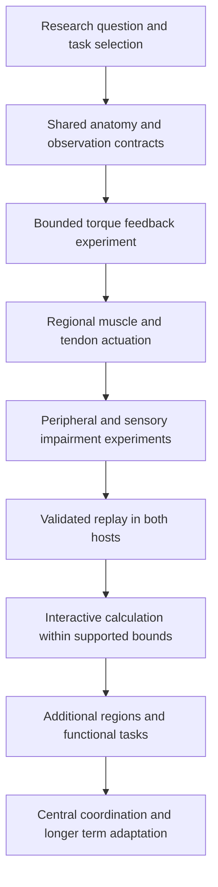

# Incremental implementation and delivery roadmap

Build one explainable task through the complete pipeline, then add mechanisms and task coverage. This roadmap is a proposed dependency sequence. Record actual implementation ownership, affected movement contexts, defects, reference links and acceptance in the [existing master](../MASTER-MOVEMENT-JOINT-CATALOGUE.html); this document is not a second execution ledger.

## Dependency sequence

Data curation, anatomy inspection, controller design and delivery contract work can proceed independently when their files and assumptions do not overlap. Their integration remains conditional on the preceding evidence. Named clinical conditions enter only when the relevant mechanism and population evidence are available.

## Increment 0 Research and task definition

**Purpose:** establish a question and a tractable model before coding a physiological interpretation.

The initial candidate is supported elbow flexion and extension toward a specified target under a controlled load. Select an existing fixture only after auditing joint axes, represented masses, support reactions, range and skin alignment. Compare it with a public regional model and dataset candidate. If its assumptions cannot answer the question, refine the task or model openly rather than inheriting them silently.

Required artifacts:

- A question naming task, population, variables, measured outputs and the educational explanation to be supported.
- An actual source and asset audit, including dirty files, tool versions, dependency pins and existing work ownership.
- A dataset card identifying raw, processed, estimated and generated channels; access and redistribution terms; coordinate conventions; missing channels; and a participant-separated calibration and validation split.
- A model choice decision that explains the represented muscles, joints, supports and unmodeled mechanisms.
- Acceptance metrics with threshold derivations, existing limits and reviewers recorded before candidate selection.

**Exit decision:** the chosen data and model can support the declared question, or the question is narrowed to an engineering mechanism experiment with its validation gap retained. License uncertainty prevents redistributing the asset; an unavailable measured channel prevents claiming validation of that channel. Documentation can progress while those dependencies are investigated.

## Increment 1 Shared anatomical and experiment foundations

**Purpose:** make source anatomy, mechanical coordinates, observations and presentation agree sufficiently to run an interpretable experiment.

Define the canonical segment and joint specification and the mappings to Blender bones, MuJoCo coordinates and host presentation. Document units, quaternion conventions, neutral pose, axes, origins, laterality and body scaling. Separate the simulated region from explicit fixture support; retain all body regions in presentation review. Register muscle attachments and nerve connectivity with provenance as proposed by the [foundation specification](03-foundation-and-anatomy.md).

Implement observation and trial contracts with versioned patient state, model configuration, controllers, source hashes, seeds, physics timing and measurement provenance. Extend existing experiment fingerprints and failure handling. Establish a healthy engineering baseline with current bounded torque actuation before interpreting muscle or neural outputs.

**Tests:** isolated joint direction and transform round trips; mass and inertia validity; support and skin geometry; fresh and stale trial identities; serialization and replay timing; missing channel and unsupported input rejection. Use the existing whole-body Blender and catalogue requirements when motion or assets change.

**Exit decision:** no unexplained coordinate, support or source identity disagreement remains within the selected task. The baseline is reproducible and its bounds and unsupported body variants are explicit. This establishes the experiment foundation, not physiological validity.

## Increment 2 Sensory feedback using bounded torque control

**Purpose:** demonstrate that a sensor model causally influences movement.

Wrap selected joint position, velocity and contact or load observations in deterministic sampling, delay, noise, dropout and reliability processing. Give the experimental task controller only its permitted observation packet. Separate the measurement and emergency-stop path from motor planning; stop logic must not silently repair the movement.

Hold task, body, motor capacity, initial conditions and controller parameters fixed. Compare intact observation, changed load, delayed observation and reduced reliability. Include a sham change, a zero-effect configuration and a deliberately privileged controller as diagnostic controls. Reject a supposed sensory controller that reads unsensed internal state or receives the perturbation answer directly.

**Tests:** delay histories and initialization; seeded reproducibility; channel disconnection; hidden state access; perturbation timing; controller saturation; timestep sensitivity; explicit failure and restart behavior. See [the experiment protocol](04-validation-and-experiments.md).

**Exit decision:** observation consumption and execution order pass causal checks, and the predeclared effect hypotheses receive an honestly reported outcome. Null, improved and adverse task performance remain possible; do not manufacture a deficit to satisfy an expected direction. Every supported condition stays within its declared domain or reports failure. Torque effort remains torque effort; no muscle activity or specific neural injury is inferred from it.

## Increment 3 Regional muscle and tendon mechanics

**Purpose:** introduce explainable actuation for the bounded region.

Evaluate a sourced regional muscle model and its reuse terms. Implement the chosen activation dynamics, active and passive force behavior, muscle path leverage, tendon model and physiological parameter provenance. Verify the equations using controlled probes before tuning a task controller. Remove or explicitly account for residual joint actuators and external support forces; a muscle demonstration must not succeed through an undisclosed motor.

Reuse task and observation interfaces so the actuation change is visible and comparable. First test torque realization independently of task control: version the muscle allocator, hold high-level demand fixed, and report realized torque and the feasible torque envelope. Preserve comparable capacity/support conditions where the question requires them; otherwise report the differences as confounds. Validate healthy kinematics and relevant load or torque channels independently. Compare recruitment timing with suitable EMG where available; state which magnitudes remain model estimates. Evaluate co-contraction and sensitivity to uncertain muscle parameters.

**Exit decision:** the regional model meets its declared mechanics and reference checks without hidden assistance. Missing tendon or force evidence limits the claims instead of being replaced by plausible animation. OpenSim comparison is useful cross-model evidence; agreement between simulators alone does not establish experimental truth.

## Increment 4 Peripheral pathways and impairment mechanisms

**Purpose:** connect pathway and tissue changes to coherent physical behavior and teaching explanations.

Curate the many-to-many root, plexus, nerve branch, muscle and sensory territory relationships. Represent motor transmission, afferent reliability and mechanical parameters separately. First compare explicit engineering mechanisms: motor capacity reduction, sensory degradation and mechanical resistance or tendon alteration.

Use a frozen healthy controller for the immediate condition and a separately identified adaptation procedure for the learned condition. Record training exposure and parameter changes. A retuned controller cannot stand in for an acute lesion response. Named nerve, root and orthopaedic conditions require independent clinical evidence for their specific modeled scope.

Define which examination findings are authored, mechanically computed or supported by a physiological model. Connect existing exams to the shared patient state with these provenance labels. Test contradictions across strength, movement, sensation, reflexes and explanations; a joint torque measurement cannot automatically become a manual muscle test grade.

**Exit decision:** each pathway change has traceable connectivity and demonstrated effects, controls exclude unintended changes, and educational claims have appropriate review. Unsupported clinical combinations remain explicit. Parameter ranges are bounded to the inspected evidence.

## Increment 5 Faithful replay and teaching delivery

**Purpose:** deliver the same verified trial in simMOVE and simLAB.

Add a versioned simulation result packet through the existing shared engine and host boundaries. Replay recorded body states, anatomy overlays, contact events and declared measurements from the same trial identity. Give each result an immutable identifier and output payload/chunk hashes as well as its input fingerprints. Validate schema, units, coordinate frames, monotonic timestamps, completeness and matched body/measurement streams before display. Reject truncated/corrupted results and late responses to superseded requests. Existing saved trial evidence does not persist complete native replay transforms, so persistent result storage is new implementation work. Preserve authored movement as a clearly identified mode. Specify interpolation and what can be displayed at a replay time without manufacturing unsampled contact or force peaks.

Build comparison views that explain the educational question: identical goals, different conditions, synchronized motion and supported internal measurements. Include represented body structures and controls the learner can meaningfully use. Existing clinical scenarios must keep their saved-data and playback compatibility.

**Tests:** physics and render clock agreement; stale result rejection; body and mesh mappings; discontinuities; overlays and force timestamps; changing viewing speed; full-cycle Blender review; actual simMOVE and simLAB paths; reset, recording and subsequent motion state. Check performance on the intended device class.

**Exit decision:** both hosts display the verified result faithfully, the master contains current required manifests, and reviewers can distinguish replay, authored animation and calculated estimates. A completed local trial does not establish production delivery. Merge, host pin updates and deployment follow existing authorization and gates.

## Increment 6 Interactive calculation and bounded adaptation

**Purpose:** allow a learner to change supported goals or conditions and receive a newly calculated result.

Benchmark the selected model on the target devices before choosing local WASM or a hosted service. Decide based on latency, determinism, resource use and deployment constraints. Keep simulation ticks independent of rendering. Define cancellation, initialization, bounded computation, solver errors, unsupported input handling and concurrent sessions. An unavailable runtime should clearly retain verified replay capabilities.

Extend fingerprints to the actual worker or service build, solver bytes, model, controller, patient state and environment. Test authoritative failure propagation and user changes during calculation. Present a newly changed physical speed as a new trial; slow-motion viewing retains the original trial.

**Exit decision:** supported conditions satisfy an explicit measured performance budget and the same scientific and movement gates as offline trials. Define any reduced model by the channels and tasks it preserves, then validate the reduction independently.

## Increment 7 Additional regions and functional tasks

**Purpose:** generalize through evidence rather than through a larger visual atlas alone.

Progress from the supported region to shoulder and hand coordination, supported lower limb control, standing and weight shifts, reaching, transfers, gait and stairs, then loaded or more dynamic tasks where justified. Choose order by educational value, source quality and foundational dependencies. Each new region needs its own axes, attachment paths, sensor mappings and actuation evidence; each task needs its own contact and validation scope.

Integrate head and neck, trunk and pelvis, opposite limbs, digits and helper bones according to their actual roles. Retain body-specific geometry and applicable sides. Validate body proportion, equipment, surface, load and speed changes as explicit contexts. A successful default movement does not qualify an unbounded slider space.

**Exit decision for each addition:** the bounded task passes source, mechanical, whole-body, clinical and delivery requirements for the declared scope. Shared-controller changes trigger affected-context regression and fresh catalogue identities.

## Increment 8 Central coordination and longer term adaptation

**Purpose:** evaluate functional state estimation, descending coordination and learning mechanisms after their mechanical substrate is credible.

Investigate coordination constraints, state estimation uncertainty, reflex regulation and adaptive policies as separate hypotheses. Keep functional cortical, cerebellar or spinal labels tied to modeled behavior, not anatomical fidelity claims. Central injuries require mechanism-specific evidence and additional clinical review; their effects cannot be assumed from peripheral weakness parameters.

Specify learning exposure, objectives, memory, forgetting, limits and held-out tasks. Test unfamiliar perturbations and model errors. Distinguish online feedback, trial-to-trial adaptation and long-term training. Reward design and observed task success do not establish human recruitment or realistic recovery.

**Exit decision:** learning and coordination claims have independent evidence, parameter sensitivity and failure coverage. Patient-specific lesion prediction or rehabilitation outcomes require a separately scoped research program.

## Refinement and release decisions

When an increment fails, retain the first failing event and baseline. Investigate measurement, coordinates, support, mechanics, sensors, controller and delivery in that order where applicable. Change one justified cause, rerun the relevant experiment, and broaden regression only for changed dependencies or unresolved concerns. Stop expanding the model when additional detail does not improve the target claim within its uncertainty.

Every implementation batch ends with a reproducible handoff using [the working protocol](07-working-protocols.md): matching inputs, executed checks, retained failures, scoped review, master links and the next justified action. No elapsed-time estimate substitutes for an exit criterion. Estimate effort after the first measured experiment establishes the integration and data costs.
